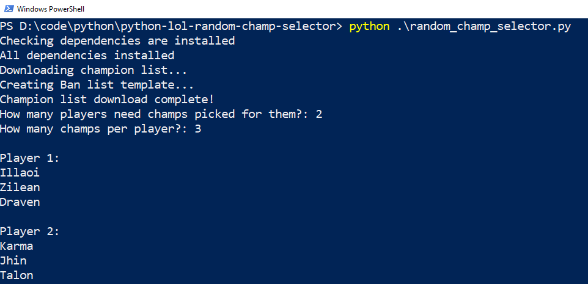

## Random Champ Selector

Ever been in a situation where you are running a 1v1 League of Legends tournement and you want everyone to be assigned a random set of champions?

Maybe there are even a group you champs you all have so much that you don't want to see them in your 'Fun' tournement.

This with this tool, you can achieve all this.

Clone this repo, and run the `random_champ_selector.py` file.

It will install the necessary dependencies (`requests`) and then run the program. 

First, it will call the Riot API and check that the champ file it still up to date. If not, it will updated it with the newly released champs.
It will also then ask to update your ban template file as well.

To stop any champs from being randomly picked, simply go in to the `banned_champs.txt` file and remove the `#` from in front of their name.

It will ask how many players and how many champs to be randomly selected for each, then print that out to the terminal.

